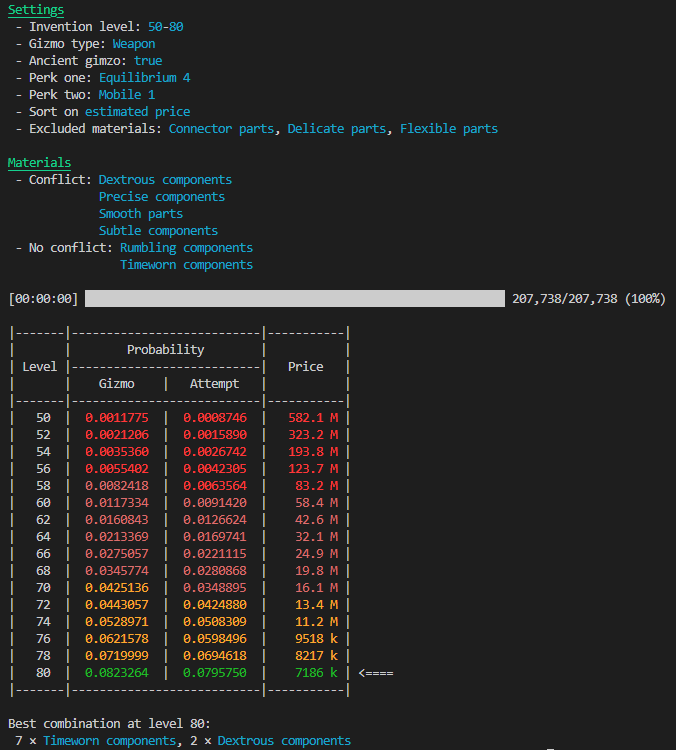

Finds the optimal material combination and invention level for a given set of perks.

Use `./perk_solver --help` to display the help text. Or `./perk_solver.exe --help` on windows.

## Example
```sh
$ ./perk_solver -t weapon -l 1,137 -a gizmo equilibrium 4 mobile -e connector,delicate,flexible
```


## Build from source
* Clone this repo `git clone https://github.com/CephHunter/Runescape-perk-solver.git`
* Make sure [Rust](https://www.rust-lang.org/) is installed
* Build with `cargo build --release`
* The binary in now located in `./target/release/perk_solver[.exe]`
